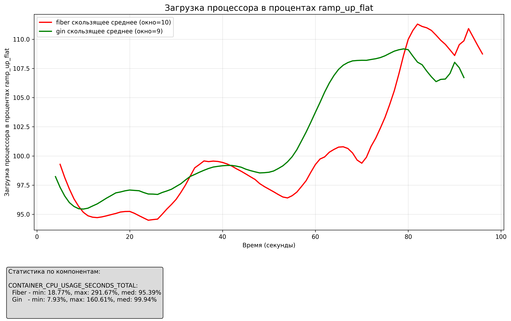
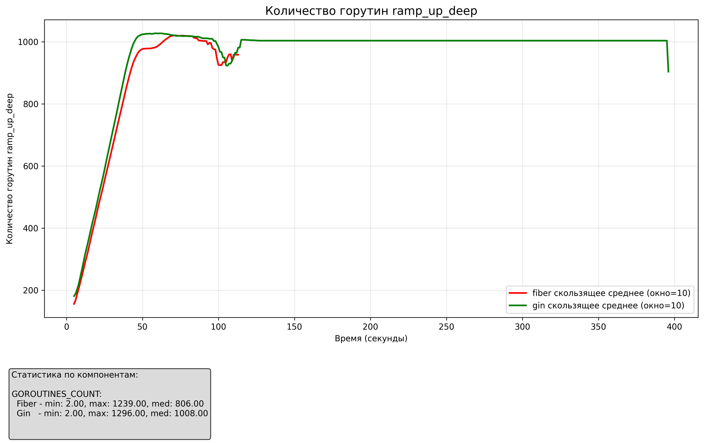
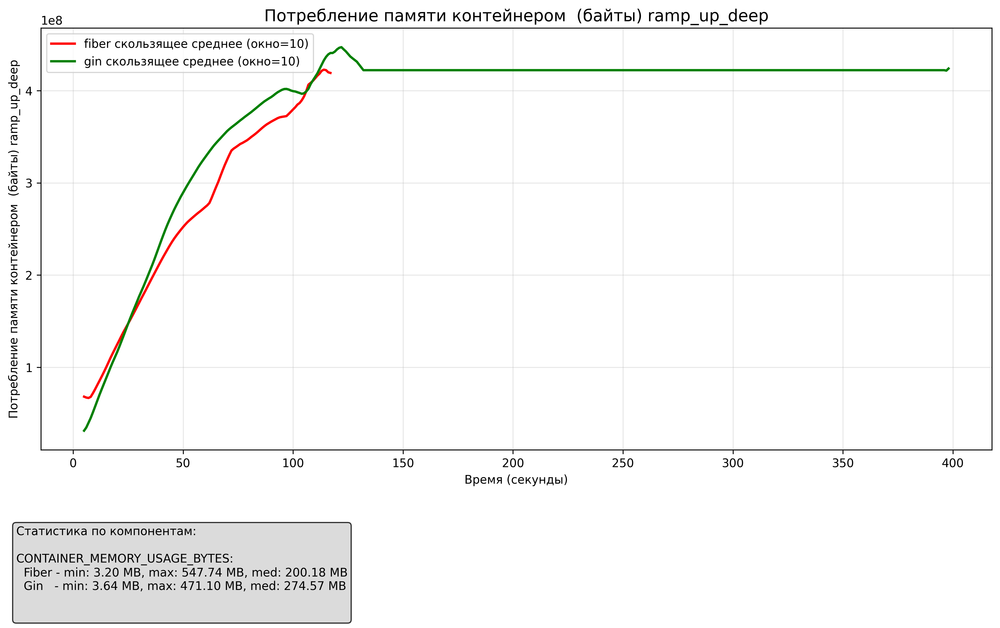
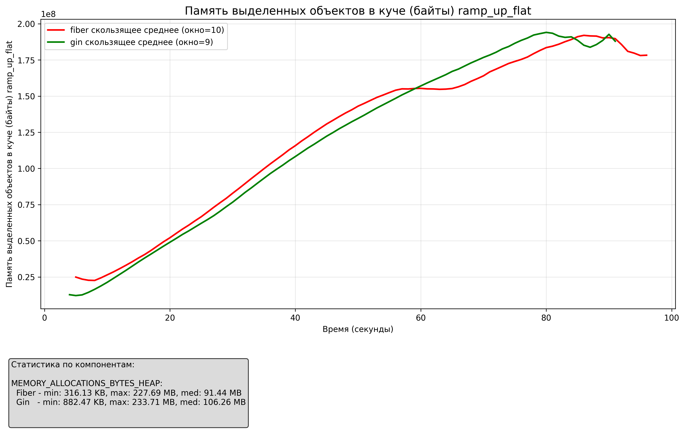
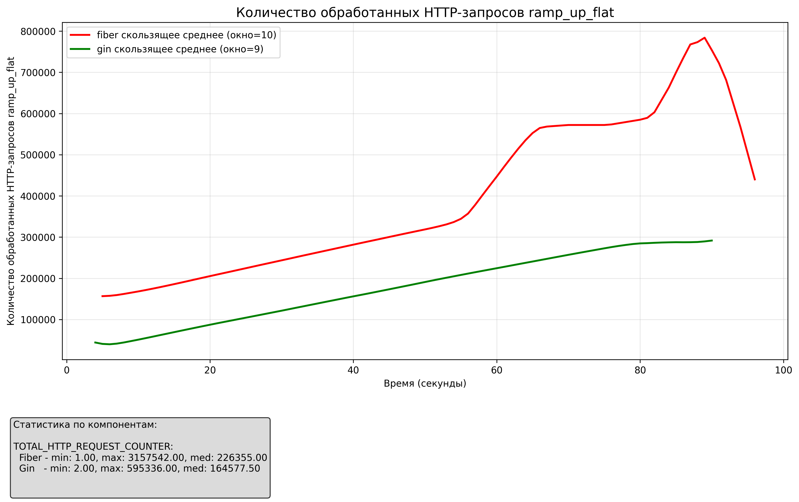

# Сравнение web-фреймворков gin и fiber на скорости сериализации json-обьектов
## Сравниваемные типы json-обьектов
1 - Плоский, 500 полей
```
{
  "field_1": "example string",
  "field_2": 42,
  "field_3": 3.14159,
  "field_4": true,
  "field_5": "another text",
  "field_6": -15,
  "field_7": 2.71828,
  "field_8": false,
  ...
  "field_500": "final field value"
}
```
2 - Древовидный, 6 уровней вложенности
```
{
  "id": "node_0_888",
  "name": "RootNode",
  "value": 99.999,
  "children": [
    {
      "id": "node_1_777",
      "name": "ChildOne",
      "value": 33.333,
      "children": [ ... ]
    },
    {
      "id": "node_1_333",
      "name": "ChildTwo",
      "value": 66.666,
      "children": [ ... ]
    },
    {
      "id": "node_1_222",
      "name": "ChildThree",
      "value": 77.777,
      "children": [ ... ]
    }
  ]
}
```
## Рассмотренные сценарии
+ поиск точки деградации производительности 
+ работа на максимальной допустимой нагрузке 
+ восстановление после перегруза

## Способ использования benchmark:
    Повторить 100 раз:
        a. поднимается докер образ с выбранным объектом оценки
        b. запускается набор тестов для оценки важных параметров
        c. собирается статистика с такого прогона (на основании лога, либо через условный attach каких-то артефактов к шагам сценария и их анализом, ключевое – данные должны быть обработаны автоматически либо сгруппированы в .csv, на который можно натравить тот же excel)
    e. собирается окончательная статистика по всем прогонам и формируется отчет
    f. проверяется альтернативный объект тем же способом и формируется отчет

# Результаты

## Поиск точки деградации производительности 

| Метрика | Плоский JSON | Древовидный JSON |
|---------|-----------|-----------|
| **Скорость сериализации** |  |  |
| **Скорость обработки запросов** |  |  |
| **Загрузка процессора (%)** |  |  |
| **Количество горутин** |  |  |
| **Потребление памяти контейнером** |  |  |
| **Память в куче** |  |  |
| **Память в стеках** |  |  |
| **Количество обработанных запросов** |  |  |

<!-- ## Поиск точки деградации производительности 
### Плоский json-обьект
#### Сокорость сериализации


#### Сокорость обработки запросов по времени


#### Загрузка процессора в процентах


#### Количество горутин


#### Потребление памяти контейнером


#### Память в куче


#### Память в стеках 


#### Количество обработанных запросов


### Древовидный json-обьект 
#### Сокорость сериализации


#### Сокорость обработки запросов по времени


#### Загрузка процессора в процентах


#### Количество горутин


#### Потребление памяти контейнером


#### Память в куче


#### Память в стеках 


#### Количество обработанных запросов
 -->


## Работа на максимальной допустимой нагрузке
### Плоский json-обьект

### Древовидный json-обьект

## Восстановление после перегруза
### Плоский json-обьект

### Древовидный json-обьект


# Настройка cAdvisor для WSL2
**Проблема:** /var/lib/docker/ в случае wsl2 - пуст. Информация, которую ищет cadvisor, находится в файлах wsl: `\\wsl.localhost\docker-desktop\mnt\docker-desktop-disk\data\docker/`. Надо настроить доступ из ubuntu в файлам wsl.

[Ссылка на issue](https://github.com/vacp2p/wakurtosis/issues/58)

### Сделать при каждом запуске wsl2
```bash
./mount_docker.sh
```
или
``` bash
$ ls /mnt/
c  e  wsl  wslg

$ sudo mkdir /mnt/windows_docker
# Docker Desktop должен работать
$ sudo mount -t drvfs '\\wsl.localhost\docker-desktop\mnt\docker-desktop-disk\data\docker' /mnt/windows_docker
```
### docker compose
```
  cadvisortest:
    image: gcr.io/cadvisor/cadvisor:latest
    container_name: cadvisortest
    hostname: cadvisortest
    ports:
      - "8081:8080" 
    privileged: true
    devices:
      - /dev/kmsg:/dev/kmsg
    volumes:
      - /:/rootfs:ro
      - /var/run:/var/run:rw
      - /sys:/sys:ro
      - /var/lib/docker:/var/lib/docker:ro
      - /dev/disk/:/dev/disk:ro
      - /etc/machine-id:/etc/machine-id:ro
      - /mnt/windows_docker/:/rootfs/var/lib/docker:ro # особенность wsl
    networks:
      - test-network
```

container_cpu_usage_seconds_total{name="deployment-gin-app-1"}
rate(container_cpu_usage_seconds_total{name="deployment-gin-app-1"}[1m])*100

container_memory_usage_bytes{name="deployment-gin-app-1"}

 
container_spec_memory_limit_bytes{name="deployment-gin-app-1"}
container_memory_rss{name="deployment-gin-app-1"} 
container_memory_cache{name="deployment-gin-app-1"} 

container_fs_reads_bytes_total{name="deployment-gin-app-1"} 
container_fs_writes_bytes_total{name="deployment-gin-app-1"} 
  